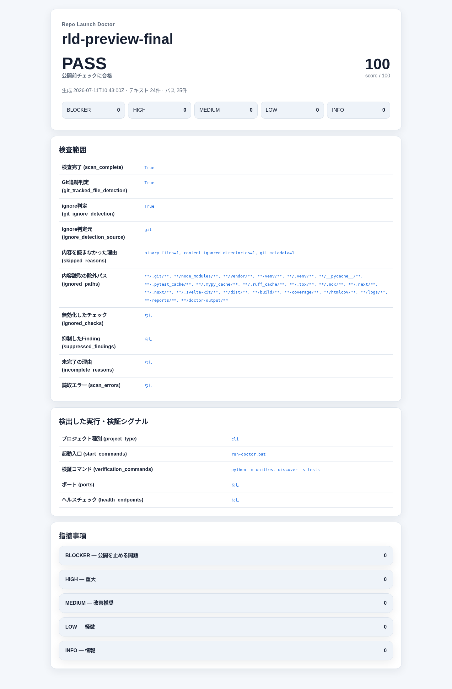

# Repo Launch Doctor

[](https://github.com/misaka310/repo-launch-doctor/actions/workflows/tests.yml)

公開前のローカルリポジトリを**読み取り専用**で静的検査し、初見ユーザーが起動方法を見つけられる構成か、ドキュメントと実装が噛み合っているか、公開してはいけないファイルが混ざっていないかをレポートするPython CLIです。

対象リポジトリに書かれたコマンドは実行しません。実際の起動成功を保証するツールではなく、起動入口・検証入口・公開構成の不備を事前に発見するためのツールです。検査結果はJSON・Markdown・HTMLで保存します。

## こんなときに使います

- GitHubで公開する前に、README・LICENSE・SECURITY・設定例を確認したい
- clone後の起動入口やテスト入口が見つけやすいか確認したい
- `.env`、秘密鍵、Cookie、ローカル設定が追跡されていないか確認したい
- `build/`、ログ、キャッシュ、仮想環境などがGitへ混入していないか確認したい
- Markdownの画像・相対リンク切れを確認したい
- Webアプリのfaviconやhealth endpoint不足を確認したい

## 必要環境

- Python 3.11以上
- Gitは任意です。利用できる場合は追跡済み・ignore済みを正確に区別します
- Windows、Linux

外部Pythonパッケージは不要です。Windows・Ubuntu上のPython 3.11〜3.13をCI対象にしています。

## 最短セットアップと使い方

### Windows

cloneまたはZIP展開後、検査対象フォルダを渡します。検査したいフォルダを`run-doctor.bat`へドラッグ＆ドロップしても実行できます。

```bat
run-doctor.bat C:\path\to\target-repo
```

処理後、時刻付きフォルダへレポートを保存し、HTMLを開きます。

```text
reports/<repo-name>-<timestamp>/report.html
```

引数を省略するとRepo Launch Doctor自身を検査します。

```bat
run-doctor.bat
```

既定では`HIGH`以上を検出すると終了コード1になります。第2引数で変更できます。

```bat
run-doctor.bat C:\path\to\target-repo none
run-doctor.bat C:\path\to\target-repo blocker
run-doctor.bat C:\path\to\target-repo medium
```

### Windows・Linux共通

インストールせず、clone先から実行できます。

```bash
python -m repo_launch_doctor scan /path/to/target-repo --output reports/target --fail-on high
```

CLIとしてインストールする場合:

```bash
python -m pip install .
repo-launch-doctor scan /path/to/target-repo --output reports/target --fail-on high
```

バージョン確認:

```bash
repo-launch-doctor --version
```

## 判定の読み方

| 判定 | 意味 |
|---|---|
| `PASS` | 指摘事項なし |
| `PASS_WITH_NOTES` | 公開を止める問題はないが、改善点あり |
| `FAIL` | `BLOCKER`または`HIGH`があり、公開前に修正が必要 |
| `INCOMPLETE` | 上限到達、読取失敗、内部チェック失敗などにより検査未完了。公開判断には使わない |

`INCOMPLETE`ではスコアを表示しません。`--fail-on none`を指定しても終了コード2になります。

| 重要度 | 意味 |
|---|---|
| `BLOCKER` | Git追跡済み秘密情報候補や、検査未完了など公開判断を止める問題 |
| `HIGH` | 起動入口不足、READMEの重大不足、リンク切れ、未保護の秘密情報候補 |
| `MEDIUM` | 検証・保守・公開品質を弱くする問題 |
| `LOW` | 分かりやすさや事故防止の改善点 |
| `INFO` | 情報 |

点数だけではなく、個別のFindingと`scan_complete`を確認してください。

## 出力

```text
report.json   CI、集計、別ツール連携用
report.md     GitHub Issueやレビューへの貼り付け用
report.html   人が確認する折り畳み式レポート
```

実際の自己診断レポート:



共有時の個人情報漏えいを避けるため、レポートには既定で対象リポジトリ名だけを記録します。絶対パスが必要な場合のみ明示的に指定します。

```bash
repo-launch-doctor scan . --include-absolute-path
```

JSONには`schema_version`が含まれます。現在のスキーマは`1.0`です。

## 実際に確認するもの

- READMEの要件、セットアップ、使い方、検証、制限事項
- ルートのランチャー、`package.json`/Python CLI、Makefile、Docker、Go、ブラウザ拡張、READMEに明記された一般的な起動入口
- Markdown内の相対リンク・画像リンク
- Git追跡状態を含む秘密情報らしいファイル名と、`.env.*`・`.npmrc`などの機密設定項目（値はレポートへ出力しません）
- Git追跡済みのログ、キャッシュ、依存ツリー、仮想環境、build成果物
- Webアプリのfavicon宣言と実ファイル
- 動的Webアプリの`/health`・`/status`
- 実行コード内のポートとhealth endpoint
- 実在するtest・lint・typecheck・buildコマンド
- LICENSE、SECURITY、必要な設定例
- 検査範囲、読み飛ばした理由、抑制したFinding、上限到達、読取失敗
- `auto`設定時のWeb・静的Web・CLI・library・docsの推定

ポートやhealth endpointの検出では、`tests/`、`docs/`、`examples/`、`reports/`のサンプル値を実機能として数えません。

## プロジェクト別設定

対象リポ直下へ`.repo-launch-doctor.json`を置きます。

```json
{
  "project_type": "web",
  "ignore_paths": [],
  "ignore_checks": [],
  "expected_ports": [8717],
  "expected_start_commands": ["start.bat"],
  "expected_health_endpoints": ["/health"],
  "accepted_generated_paths": ["public/generated-demo/**"],
  "max_files": 10000,
  "max_paths": 100000,
  "max_file_bytes": 1000000
}
```

設定例は[.repo-launch-doctor.example.json](.repo-launch-doctor.example.json)、全項目は[設定リファレンス](docs/configuration.md)を参照してください。

重要な挙動:

- 未知の設定キー・check IDはエラーにします
- `secret-risk-file`、`scan-incomplete`、`internal-check-error`は無効化できません
- `ignore_paths`は内容読取の除外です。Git追跡済みの秘密情報候補を隠しません
- 抑制したFindingと除外範囲はレポートへ明示します
- 自動判定が合わない場合は`project_type`を明示してください

check ID一覧は[チェックリファレンス](docs/check-reference.md)にあります。

## Git履歴を検査する

現在の作業ツリーとは別に、選択したコミットで追加されたテキスト、秘密情報らしいファイル名、コミットメッセージを検査できます。検出した値そのものはレポートへ出しません。

```bash
# PRやpush対象の範囲
python -m repo_launch_doctor history-scan . --range origin/main..HEAD --output reports/history

# ローカル参照から到達できる全履歴を一度確認
python -m repo_launch_doctor history-scan . --all-history --output reports/full-history

# pre-push hookなどが作成したSHA一覧を検査
python -m repo_launch_doctor history-scan . --commits-file commits.txt --output reports/outgoing
```

`history-scan`は、秘密値を追加した後のコミットで削除していても、追加時のコミットを検査対象に含めれば検出します。秘密鍵ヘッダー、主要サービスのトークン形式、認証情報入りURL、機密キーへの値代入、`.env`などの秘密情報らしい追跡ファイルを対象にします。

## CIで使う

```bash
python -m repo_launch_doctor scan . --output reports/ci/current --fail-on high
python -m repo_launch_doctor history-scan . --range "$BASE_SHA..$HEAD_SHA" --output reports/ci/history
```

同梱の`.github/workflows/repo-launch-doctor.yml`は公開リポジトリ向けです。PRごとに自動実行し、連続して更新された場合は古い実行をキャンセルします。非公開リポジトリへは原則導入しません。誤ってコピーされた場合もPRジョブは起動せず、明示的な`workflow_dispatch`だけが実行可能です。

終了コード:

- `0`: 指定基準を超えるFindingなし
- `1`: 現在状態の指定基準以上、または履歴内の秘密情報候補を検出
- `2`: 設定エラー、Git範囲解決失敗、入出力エラー、内部チェック失敗、検査未完了

## 検証

```bash
python -m repo_launch_doctor scan . --output reports/self --fail-on high
python -m unittest discover -s tests -v
python -m compileall repo_launch_doctor tests
```

PRではWindows・UbuntuのPython 3.12だけを検証し、1回のPR更新を2ジョブに抑えます。Python 3.11〜3.13の全互換性検査は`workflow_dispatch`で必要なときだけ実行します。`push`起動は行わないため、PR検証とマージ後検証の二重実行はありません。連続更新時は古い実行をキャンセルします。Windowsでは別フォルダをカレントディレクトリにして`run-doctor.bat`を呼ぶテストも実行します。

外部リポジトリでの評価方法と結果は、[現在の公開リポジトリ監査](audits/current/README.md)と[固定SHAの回帰ベンチマーク](benchmarks/README.md)に分離しています。

## 安全性

- 対象リポジトリを変更しません
- 対象リポジトリに記載されたコマンドを実行しません
- 秘密情報候補の内容をレポートへ転記しません
- 通常スキャンでは`.git`、依存ツリー、モデル、メディア、大容量ファイルの内容を読みません。`history-scan`はGitからコミットメッセージとテキスト差分だけを読みます
- ファイル名とGit追跡状態は内容読取とは分離して確認します
- シンボリックリンクを追跡しません
- 上限到達、テキスト読取失敗、内部チェック失敗を成功扱いしません

脆弱性報告は[SECURITY.md](SECURITY.md)を参照してください。

## 制限事項

- 静的検査です。READMEに書かれたコマンドが実際に成功するかは判定しません
- `history-scan`は既知形式と機密キーへの値代入を静的検出しますが、あらゆる秘密値・業務機密・未知形式を完全には判定できません
- バイナリ差分、画像、PDF、ZIP、モデルなどの内部に埋め込まれた秘密情報は内容検査しません。レポートにスキップ件数を表示します
- 独自ビルドシステムや動的に生成される入口は検出できない場合があります
- 自動プロジェクト種別判定は推定です。誤判定する場合は設定で明示してください
- faviconは宣言とファイルの存在を確認しますが、ブラウザ表示までは確認しません
- スコアはセキュリティ監査、脆弱性診断、法務確認の代替ではありません
- Gitがないフォルダでは追跡状態を区別できません。`.gitignore`の一般的な規則は補助利用します

## Contributing

不具合報告や改善提案は歓迎します。[CONTRIBUTING.md](CONTRIBUTING.md)を参照してください。

## License

MIT License
