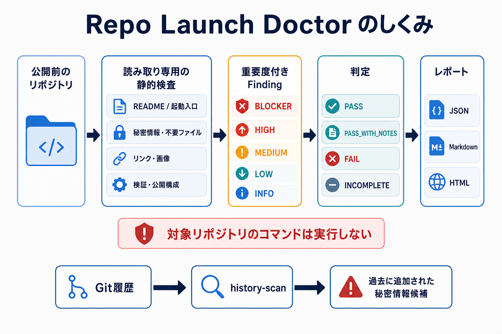

# Repo Launch Doctor

[](https://github.com/misaka310/repo-launch-doctor/actions/workflows/tests.yml)

公開前のローカルリポジトリを**読み取り専用**で静的検査し、初見ユーザーが起動方法を見つけられるか、READMEと実装が噛み合っているか、公開してはいけないファイルが混ざっていないかをレポートするPython CLIです。

対象リポジトリに書かれたコマンドは実行しません。実際の起動成功を保証するツールではなく、公開前に構成・説明・追跡ファイルの不備を見つけるためのツールです。結果はJSON・Markdown・HTMLで保存します。

<p align="center">
  
</p>

## こんなときに使います

- GitHubで公開する前に、README・LICENSE・SECURITY・設定例を確認したい
- clone後の起動入口やテスト入口が見つけやすいか確認したい
- `.env`、秘密鍵、Cookie、ローカル設定が追跡されていないか確認したい
- ログ、キャッシュ、仮想環境、build成果物がGitへ混入していないか確認したい
- Markdownの画像・相対リンク切れを確認したい
- Webアプリのfaviconやhealth endpoint不足を確認したい

## 必要環境

- Python 3.11以上
- WindowsまたはLinux
- Gitは任意。利用できる場合は追跡済み・ignore済みを正確に区別します

外部Pythonパッケージは不要です。

## 最短セットアップ

### Windows

cloneまたはZIP展開後、検査対象フォルダを渡します。対象フォルダを`run-doctor.bat`へドラッグ＆ドロップしても実行できます。

```bat
run-doctor.bat C:\path\to\target-repo
```

処理後、時刻付きフォルダへレポートを保存してHTMLを開きます。

```text
reports/<repo-name>-<timestamp>/report.html
```

引数を省略するとRepo Launch Doctor自身を検査します。

```bat
run-doctor.bat
```

既定では`HIGH`以上を検出すると終了コード1です。判定基準を変える場合は第2引数へ`none`、`blocker`、`medium`などを指定します。

### Windows・Linux共通

インストールせずclone先から実行できます。

```bash
python -m repo_launch_doctor scan /path/to/target-repo --output reports/target --fail-on high
```

CLIとしてインストールする場合:

```bash
python -m pip install .
repo-launch-doctor scan /path/to/target-repo --output reports/target --fail-on high
```

## 判定の読み方

| 判定 | 意味 |
|---|---|
| `PASS` | 指摘事項なし |
| `PASS_WITH_NOTES` | 公開を止める問題はないが、改善点あり |
| `FAIL` | `BLOCKER`または`HIGH`があり、公開前に修正が必要 |
| `INCOMPLETE` | 上限到達、読取失敗、内部チェック失敗などで検査未完了。公開判断には使わない |

`INCOMPLETE`ではスコアを表示しません。点数だけでなく、個別のFindingと`scan_complete`を確認してください。

## 出力

```text
report.json   CI、集計、別ツール連携用
report.md     GitHub Issueやレビューへの貼り付け用
report.html   人が確認する折り畳み式レポート
```


共有時の個人情報漏えいを避けるため、レポートには既定で対象リポジトリ名だけを記録します。絶対パスが必要な場合だけ`--include-absolute-path`を指定します。

## 主な検査対象

- READMEの要件、セットアップ、使い方、検証、制限事項
- ルートのランチャーと、READMEに記載された一般的な起動入口
- Markdown内の相対リンク・画像リンク
- Git追跡状態を含む秘密情報らしいファイル名と機密設定項目
- Git追跡済みのログ、キャッシュ、依存ツリー、仮想環境、build成果物
- Webアプリのfavicon、`/health`、`/status`、実行コード内のポート
- 実在するtest・lint・typecheck・buildコマンド
- LICENSE、SECURITY、必要な設定例
- 検査範囲、除外範囲、上限到達、読取失敗、内部チェック失敗

秘密情報候補の値はレポートへ出力しません。

## Git履歴を検査する

通常の`scan`とは別に、選択したコミットで追加されたテキスト、秘密情報らしいファイル名、コミットメッセージを検査できます。

```bash
# PRやpush対象の範囲
python -m repo_launch_doctor history-scan . --range origin/main..HEAD --output reports/history

# ローカル参照から到達できる全履歴
python -m repo_launch_doctor history-scan . --all-history --output reports/full-history
```

秘密値を追加した後のコミットで削除していても、追加時のコミットを対象に含めれば検出します。

## CodexProのリモート送信境界

CodexPro運用では、Repo Launch Doctorを「Publicリポジトリだけで呼ぶチェック」ではなく、**GitHubへ送信する直前の共通Doctor**として扱います。公開済みかどうかはDoctorを呼ぶ条件には使わず、送信経路と追加保護を選ぶための事実として使います。

### 全リポジトリ共通

- `git push` の`pre-push`で、実際にGitが選んだremote名・remote URL・ref更新を使ってRepo Launch Doctorを必ず実行する。
- `origin`を推測して判定しない。push先remoteのGitHub metadataからvisibilityを機械的に取得する。
- GitHub remoteなのにmetadataまたはvisibilityを確定できない場合は、送信境界ではfail-closedでpushを止める。
- Private/Publicのどちらでも、remoteへ新しく送るcommit/historyをDoctorの`history-scan`で検査する。秘密情報候補・危険なcommit内容・検査異常はpush前に止める。
- リポジトリごとの「Public Doctor hookを先に手動導入できていること」を安全性の前提にしない。共有`pre-push`が共通入口を所有する。

### Publicリポジトリ

Publicでは作業ブランチのpush時点で内容が外部から閲覧可能になるため、**最初の公開防止境界はPR後のGitHub Actionsではなくローカル`pre-push` Doctor**です。

- 作業ブランチをremoteへpushする前にローカルDoctorを通し、outgoing historyに加えてpush先tipの**exact repository state**を`scan --fail-on high`で検査する。
- default branchへの直接pushを許可せず、作業ブランチ → Pull Request → mergeの経路だけを許可する。
- Pull RequestではGitHub Actionsの`public-readiness`をもう一度実行し、ローカル検査の代替ではなく独立した二重検査・merge条件として使う。
- GitHub Rulesetはdefault branchに対してPull Request必須と`public-readiness`必須の両方を強制し、bypassを設けない。
- PrivateからPublicへvisibilityを変更する場合は、変更前に全到達履歴のDoctor baselineを成功させる。Public化後のActionsを「初回漏えい防止」として扱わない。

### Privateリポジトリ

Privateでもremote送信前Doctorは省略しません。ただしPrivateの通常pushでは、既存repository全体のREADME品質やbroken linkなど**release-readiness由来の負債で日常pushを止めず**、remoteへ新しく送るcommit/historyの安全検査を必須にします。Public専用のexact repository scan・PR/ruleset要件はPublic化またはPublic送信時だけ追加します。

この分担では、ローカル`pre-push`が「remoteへ出してよいか」、PublicのPR Actions/Rulesetが「default branchへ取り込んでよいか」を担当します。

## プロジェクト別設定とCI

対象リポ直下の`.repo-launch-doctor.json`で、プロジェクト種別、期待する起動コマンド・ポート・health endpoint、読取除外、上限を設定できます。未知の設定キーやcheck IDはエラーになり、秘密情報・検査未完了・内部エラーの検査は無効化できません。

- [設定例](.repo-launch-doctor.example.json)
- [設定リファレンス](docs/configuration.md)
- [check ID一覧](docs/check-reference.md)
- [CI・評価・再現手順](docs/evaluation.md)

CIでは現在ツリーの`scan`と、PR範囲の`history-scan`を組み合わせます。同梱の`.github/workflows/repo-launch-doctor.yml`は公開リポジトリ向けです。

## 安全性と制限

- 対象リポジトリを変更せず、READMEに書かれたコマンドも実行しません
- 秘密情報候補の内容をレポートへ転記しません
- 通常スキャンでは`.git`、依存ツリー、モデル、メディア、大容量ファイルの内容を読みません
- `history-scan`はGitからコミットメッセージとテキスト差分だけを読みます
- 静的検査のため、READMEのコマンドが実際に成功するかは判定しません
- バイナリ、画像、PDF、ZIP、モデル内部の秘密情報は内容検査しません
- スコアはセキュリティ監査、脆弱性診断、法務確認の代替ではありません

脆弱性報告は[SECURITY.md](SECURITY.md)、開発手順は[CONTRIBUTING.md](CONTRIBUTING.md)を参照してください。

## License

MIT License
